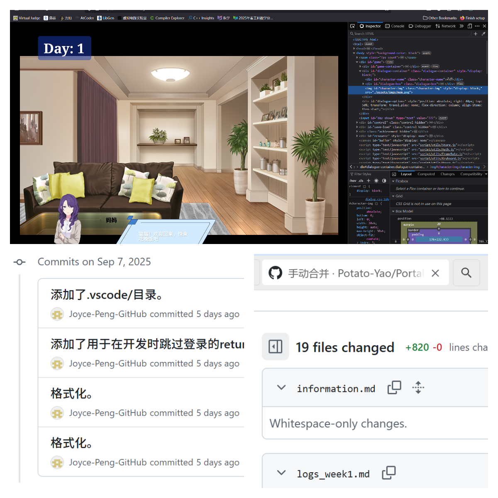
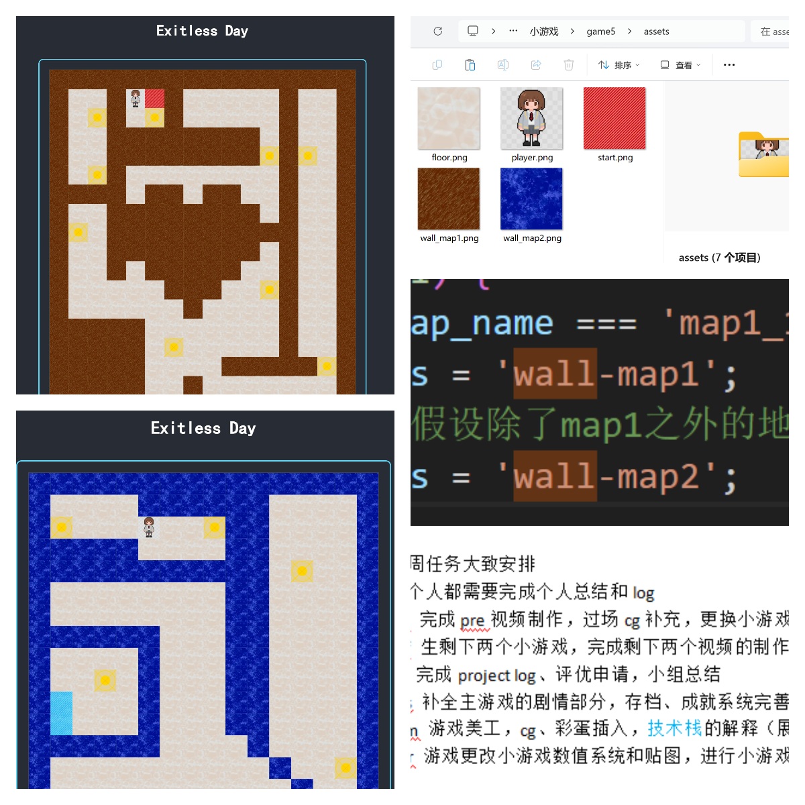
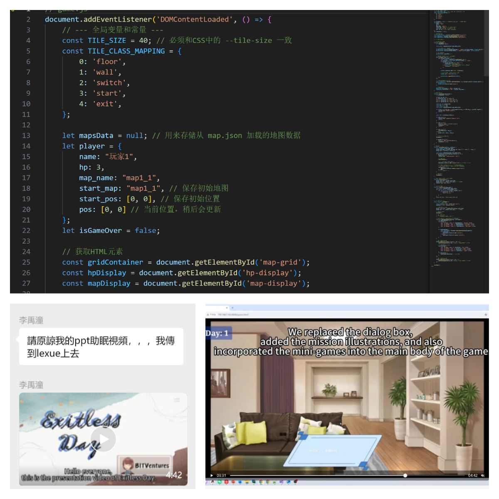
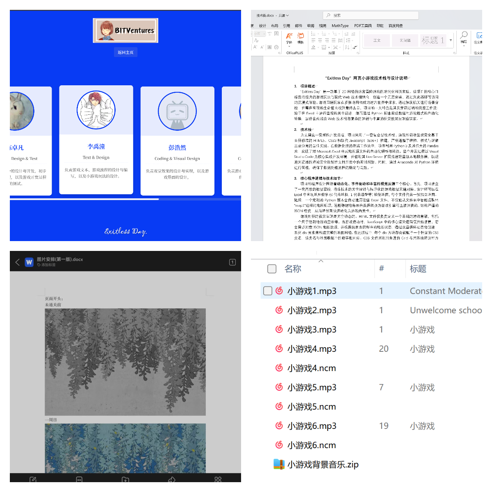
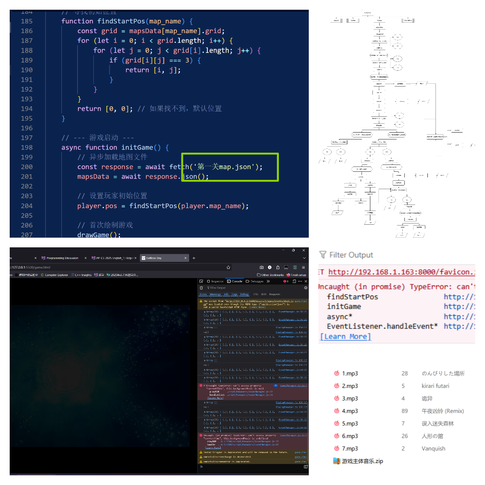
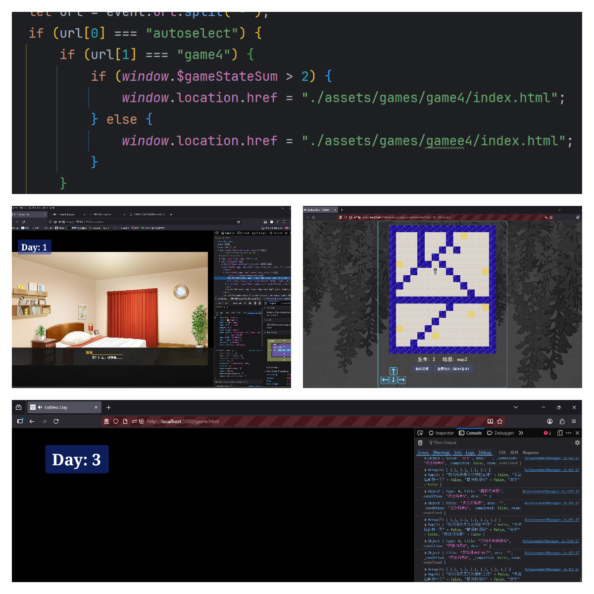
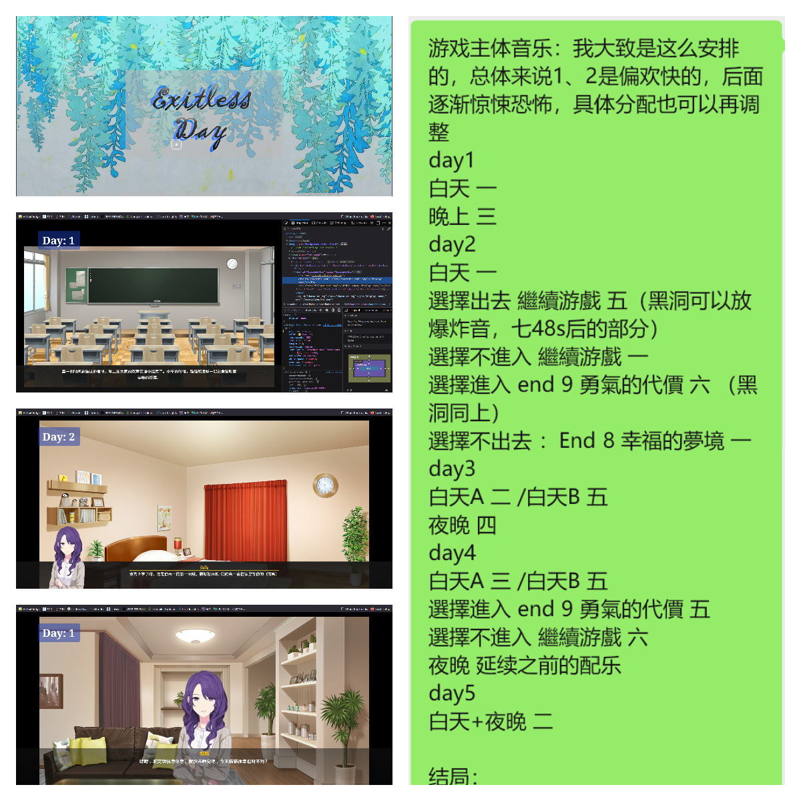

# 项目日志
## 第三周（9.7-9.13）进展

## 9月7日

#### 每日工作总结

彭浩然、姚雨森、曾梓木：
* 因小游戏缺少部分内容，砍掉了一些分支，其余部分除立绘显示还有小问题外基本完工。
* 代码提交到仓库，等待合并到 exitday 主仓库后再进行进一步调整。   

李禹潼：
* 分配任务：计划下一周制作三个视频和三个文档，每人需完成个人总结。
* 上传帖子刷活跃度，保持团队沟通频率和项目曝光。

#### 经验教训

* 小游戏分支和内容缺失可能影响整体进度，应提前确认素材完整性。
* 提前分配任务和安排个人总结，有利于团队整体进度管理。

#### 遇到的问题

* 立绘显示存在小问题，需要后续修正。
* 小游戏缺少内容，部分分支被迫删除。

#### 下一步工作

1. 合并代码到 exitday 主仓库，并检查可能的冲突。
2. 根据分工完成个人总结和视频、文档任务。
3. 关注小游戏缺失内容的补充及后续版本更新。

#### 截图证据  

---
## 9月8日  
####  每日工作总结
李禹潼：
- 初步进行任务分配，等待老师对乐学崩溃问题的反馈后再调整。     

陈卓凡、赵楠：
- 小游戏配图更新并标记。
彭浩然、姚雨森、曾梓木：
- 提出美工优化与立绘修改建议。

#### 完成的内容

* 任务分配初步确定，等待乐学平台反馈后再调整。
* 小游戏材质重新绘制：

  * 深蓝带斜杠为入口
  * 浅蓝为出口
  * 棕色为 wall1
  * 蓝色为 wall2
  * 调整了材质和引用。
* 美工修改页面：

  * 对话框调整为占屏幕下方 1/3
  * 字体颜色由白色改为黑色，改善可读性。
* 小游戏程序问题修复：走不了、退不了的 bug 已修改，预计可正常运行。
* 美工建议优化立绘：增加显示面积，使屏幕不显空白。

---

#### 经验教训

* 小游戏材质和界面布局需提前规范，避免出现逻辑和视觉冲突。
* 美工细节（对话框、字体颜色、立绘占比）对用户体验影响较大。
* 程序和美工修改需要同步沟通，避免界面和逻辑不匹配。

---

#### 遇到的问题

* 小游戏存在卡住或无法移动的情况。
* 字体颜色白色不利于阅读，需修改。
* 屏幕布局空旷，立绘显示不足。

---

#### 下一步工作

1. 测试修改后的小游戏程序，确保走动和退出功能正常。
2. 美工根据建议进一步优化立绘和界面布局。
3. 等待乐学平台反馈，根据调整结果更新任务分配。
4. 完成任务进度记录和个人总结。

---

#### 截图证据    

---

## 9月9日
#### 本日工作总结 
陈卓凡、赵楠：  
- 小游戏修改进入收尾，仅剩两个。

- 修复了角色被墙包住无法移动的问题。

- 提高了分辨率并测试，但出现页面布局异常。     

李禹潼：
- pre 视频完成初版剪辑并上传至乐学。

#### 完成的内容

* **小游戏修改** ：

  * 修复了**被墙包住无法移动**的问题。
  * 剩余 **两个小游戏** 完成修改。
  * 发现最早发布的小游戏缺少 `game.js` 文件，导致无法运行。
* **分辨率调整** ：将小游戏画面设为 **400×400 像素**，但导致页面布局异常。
* **数值系统设定** ：确认主体剧情暂无数值系统，小游戏血量应算入数值系统。
* **视频工作** ：完成了初版 **PPT 剪辑视频**（上传至乐学平台）。

---

#### 经验教训

* **分辨率与布局需平衡** ：盲目提高分辨率会导致地图过大、页面布局混乱，应结合实际显示效果逐步调试。
* **资源完整性很重要** ：缺少核心文件（如 `game.js`）会直接导致无法运行，应在发布前检查包完整性。
* **小步迭代更高效** ：先调试单关卡，再推广到所有小游戏，可以减少重复性错误。
* **视频表达需兼顾观感** ：虽然PPT 视频完成了任务，但呈现方式单一，影响观感体验。

---

#### 遇到的问题

* **小游戏缺少 `game.js`**，导致最早的版本无法运行。
* **页面布局异常**：分辨率设为 400×400 后界面显示怪异。
* **地图过大**：分辨率调整后导致整体地图超出预期范围。
* **BGM 问题**：视频配音出现“曼波音色”，与预期不符。

---

#### 下一步工作

1. **调回分辨率**：尝试缩小像素（如 200×200 或 300×300），保证既能看到完整地图又不影响布局。
2. **补全缺失文件**：为最早的小游戏补上 `game.js` 文件，确保所有小游戏可运行。
3. **数值系统确认**：细化小游戏的血量设定，决定其在整体游戏机制中的作用。
4. **项目总结文稿**：整理难点、创新点、工作量等要点，下午形成文字版。
5. **视频优化**：晚上完成视频二次剪辑，避免单调的 PPT 视觉效果，优化配音和音色。

---

#### 截图证据   

---

## 9月10日工作总结   
#### 本日工作总结  
陈卓凡、赵楠：
- 调整小游戏界面大小，明确了文件组织方式：除地图文件名不同外，其余文件基本相同。
姚雨森：
- 整合了更新内容，统一打包，优化了小游戏引用方式。    

彭浩然、曾梓木：
- 修改并精进项目文档，详细描述了 存档系统、用户系统、成就系统、前端技术实现、美工素材来源 等。
- 初步完成介绍页面效果，音乐与流程图安排基本确定。    

李禹潼：
- 与老师沟通剧情方向，得到建议：剧情需要更有条理、环环相扣并富含寓意。

- 根据建议修改剧情逻辑，增加了两个新结局。

- 收集与整理素材，包括新增场景、结局 CG、背景音乐、转场效果等。

#### 完成的内容

* **小游戏部分** (mini-games)：

  * 调整了游戏界面大小，确认 **所有小游戏共用同一个 CSS**，但地图引用名不同，每关只需修改 `game.js` 中的地图文件名。
  * 已将 ZN 更新内容打包整合，测试确认 index/style 可复用，除 `game.js` 需改动外其余文件一致。
* **项目文档精进** (documentation refinement)：

  * **存档系统**：描述了 ESC 暂停、自动存档、存档覆盖/新建、加载存档等完整功能。
  * **用户系统**：支持登录/注册，表单填写后进入账户。
  * **成就系统**：登录后可查看成就页面，已获得成就会反色显示并提示。
  * **前端技术**：HTML、CSS、JavaScript，结合 OOP 思想、CSS 动画、JS 动效、`localStorage` 数据存储与交互。
  * **美工素材**：来自网络与自制（MSPaint、Scratch、PS、AI 立绘、小游戏贴图、对话框）。风格贴近“日常+故障微恐怖”。
* **剧情与逻辑修改** (story refinement)：

  * 根据老师建议大幅修改剧情，使其更有条理、环环相扣，结尾有哲思。
  * 增加了 **两个新结局**，并配合新增 **CG 素材**（网络与手绘）。
  * 修改场景图（通过反转色处理增强恐怖感），并设计了转场（黑屏+文字）。
* **音乐收集与配置** (music arrangement)：

  * 收集了 **6 个小游戏**的音乐，从轻松到惊悚渐进。
  * 主体音乐初步分配：Day1–Day5 白天/夜晚、不同结局分别匹配不同曲目。
  * 确认转场及黑洞场景配合特效音（如爆炸音）。
* **逻辑确认** (game logic)：

  * 确认 **Day3 分支**：若至少赢 2 个小游戏 → 进入 3a，否则进入 3b；无论分支，夜晚剧情必定进入。

---

#### 经验教训

* **代码与文件结构统一性** (file structure consistency)：小游戏之间保持 CSS 与 index 复用，减少冗余，提升维护性。
* **文档细化的重要性** (detailed documentation)：详细描述功能点（存档/成就/用户系统），有助于成员理解全局架构。
* **剧情需逻辑自洽** (story coherence)：老师反馈表明，仅有事件循环不够，需要整体哲理与因果逻辑。
* **素材与风格统一** (asset consistency)：不同来源的素材需经过统一处理（如反转色），才能保持项目整体氛围。
* **音乐选曲要渐进** (music progression)：通过 Day1–Day5 音乐渐进变化，强化叙事张力。

---

#### 遇到的问题

* **小游戏发包形式不明确**：曾讨论是直接发代码文件还是压缩包，最终确认只需更改 `game.js`。
* **剧情逻辑细节**：如何判断进入 3a/3b，夜晚剧情是否跟随白天分支。
* **BGM 选择困难**：主体背景音乐未最终确定，存在犹豫。
* **素材收集压力**：需要额外的 CG、转场素材，部分由团队手绘或改图完成。

---

#### 下一步工作

1. **小游戏统一测试**：逐一验证 6 个小游戏的地图文件名引用是否正确。
2. **文档完善**：将更新后的剧情逻辑图、功能点、音乐配置写入最终项目文档。
3. **剧情优化**：继续修改文本，使结局间呼应更紧密，突出哲学寓意。
4. **素材收集与处理**：补充缺失 CG 与转场效果，保持风格一致。
5. **音乐最终敲定**：完成主体 BGM 的曲目选择与分配，测试 Day1–Day5 渐进效果。
6. **流程图绘制**：完成流程图以直观展现分支逻辑，供后续调试使用。
7. **进度收口**：尽量在周五前完成剧情、素材、音乐整合，进入整体调试阶段。

---

#### 截图证据   

---

## 9月11日
#### 每日工作总结  
陈卓凡：
- 修复并统一了 2–4 关小游戏的地图命名，解决了 mapsData[map_name] is undefined 错误。

- 对 3 个代码文件添加了新手教程说明和线索选项。

- 上传/提交了贴图分辨率调整后的压缩包，并完成一次大范围代码提交（约 111 个文件）。     

李禹潼：
- 根据剧本重写剧情文本，仅剩 BGM 和结局后的主题色调整。     

赵楠：
- 提供了 BGM 接入说明，将音乐放置在 assets/audios/bgms，并在 assets/stages/events 的 events 数组中调用。
#### 完成的内容

* **修复并统一地图命名** ：定位到 2–4 关与其他关命名格式不一致，已调整引用并解决了因命名导致的 `mapsData[map_name] is undefined` / `grid` 访问错误。
* **修改代码（含新手说明与线索选项）**  ：对**3 个文件**做了添加/修改，加入新手教程说明与线索选项。
* **提交了资源与代码变更** ：上传/提交了包含贴图分辨率调整的压缩包，并有一次较大提交（约 **111 个文件** 变动，待核对）。
* **按剧本重写剧情文本** ：已根据剧本将文本重写完成，仅剩 BGM 和结局后主题色等小项。
* **提供 BGM 接入说明** ：确认 BGM 放置路径 `assets/audios/bgms`，并在 `assets/stages/events` 的 events 数组里使用 `{"type":"playBGM","name":"filename"}` 即可播放。

---

#### 经验教训

* **统一规范优先** ：文件命名与 JSON 结构必须团队统一，命名不一致会引发运行时空指针/找不到资源的问题。
* **资产包一致性重要** ：贴图/分辨率变更会导致界面错位或旧资源残留，要有明确的资源版本与变更说明。
* **小步提交 + 明确变更日志** ：一次性大改（111 文件）增加 review 成本与回滚难度，建议拆分 PR 并写变更摘要。
* **本地复现优先**：遇到问题优先在本地复现（DevTools 控制台、查看 JSON keys），再提交到远端。
* **周末沟通需更主动** ：周日进度紧张时需更高频沟通与明确责任分配。

---

#### 遇到的问题

* **地图加载失败 / TypeError** ：`mapsData[map_name] is undefined`（找不到对应 map\_name，导致访问 `.grid` 时报错）。
* **命名格式不一致** ：ZN 的第 2–4 关与陈同学的命名风格不同（x\_1/x\_2 vs 1/2），引用名未统一。
* **界面贴图/分辨率错误** ：部分贴图看起来是旧版或像素分辨率被修改，导致 UI 显示异常。
* **ESC 无效 / 注释问题** ：ESC 功能未生效，怀疑是注释或代码覆盖导致。
* **读取 null / JSON 未找到**：部分地方直接读取到 `null` 而非报错，需定位为哪个键/文件缺失。
* **多人大规模修改带来风险** ：一次性改动范围大，复现与回退成本高。
* **个别成员缺少可用电脑** ：有人当前无电脑，影响即时调试与修复速度。

---

#### 下一步工作（优先级排序）

1. **优先修复 Day1 并保证主流程可运行** 。
2. **替换并验证 2–4 关 JSON 命名/格式** ：用统一格式（与 Chen 的命名一致）重新替换并本地测试。
3. **核对贴图压缩包与还原对比** ：比对新压缩包与 Chen 的压缩包，确认贴图、分辨率与路径一致，必要时回退。
4. **定位并修复 `null` / `TypeError` 源头** (debug null / TypeError)：在浏览器 DevTools 控制台复现错误，检查 `mapsData` 的键与加载顺序。
5. **排查 ESC 与界面显示 BUG** ：检查输入处理与像素/样式改动影响。
6. **拆分提交并建立 PR 流程** ：把大改拆成小 PR，附变更说明，便于 review。
7. **完善文档** ：补充 map JSON 格式规范、BGM 放置与调用示例、day/night 配置说明，并上传到仓库。
8. **收集并提交日志/截图证据** ：把关键报错图、文件树、提交 diff 等截图上传以便审查。
9. **通知团队并确认 git 状态** ：在群里标注已 push 的分支/commit，并请求成员核对贴图包是否一致。

---

#### 截图证据  

---

## 9月12日
#### 每日工作总结

今天主要围绕游戏开发的代码修改与功能调试展开。涉及的模块包括 **game.js、css、index 页面、音频与 ESC 菜单功能、地图缩放与适配、碰撞判定、关卡跳转逻辑、字体显示、成就系统、音乐播放稳定性** 等。团队成员之间对代码复用、地图大小适配、游戏说明文字、跳转机制和剧本对照问题进行了较多讨论，并在 GitHub 上完成了部分代码提交与合并。

---

#### 完成的任务

1. **代码修改**（曾梓木）：

   * 对 game.js 中胜利与失败判定逻辑进行了调整。
   * 修改 css 文件，尝试解决字体过小与地图大小显示问题。
   * 调整 index 页面，删除标题以适配窗口大小。

2. **功能修复与改进**（彭浩然）：

   * 修复音频播放问题（已确认可正常播放，但跳过时存在小概率异常）。
   * 调试 ESC 菜单，分析其无法呼出的原因，确认与 dialog 冲突有关。
   * 确认并修正地图像素参数问题，保证显示适配。
   * 增加了地图缩放提示（提示使用 Ctrl+滚轮缩放）。
   * 调整碰撞逻辑，优化“回到出生点”的判定。

3. **关卡与剧情**（姚雨森）：

   * 确认现有总关卡数为 6，并澄清 game4 的跳转问题。
   * 解决 day3B 跳转失败问题，通过修改 eventmanager 文件中的路径名修复。
   * 部分关卡的跳转逻辑与剧本、流程图对齐。

4. **协作与提交**（李禹潼）：

   * 多次 push 到 GitHub，保证代码更新。
   * 讨论并确认使用的剧本版本与流程图。

---

#### 遇到的问题

1. **地图显示过大**：参数调整后仍存在不同浏览器缩放显示不一致的问题。
2. **ESC 菜单无法呼出**：怀疑与全程 dialog 使用有关，需进一步调试。
3. **音乐播放不稳定**：使用 Ctrl 跳过时可能导致音乐未播放。
4. **关卡可达性问题**：例如 day3B 初始无法进入，后续通过修改 json 修复。
5. **代码复用不足**：目前仍采用逐文件复制方式，缺少统一管理与优化。
6. **成就系统缺失**：框架虽已存在，但尚未正式实现。
7. **字体与界面适配问题**：CSS 修改后效果仍不理想，部分硬编码限制较大。

---

#### 经验教训

* **及时 push 代码**：避免出现“看不到修改”的情况。
* **统一剧本与流程图版本**：确保跳转逻辑和关卡衔接准确。
* **避免过度硬编码**：字体与尺寸应尽量参数化，便于跨环境适配。
* **功能验证需多端测试**：不同浏览器缩放设置可能导致显示不一致。
* **简单可行优先**：例如通过删除标题来解决界面大小适配问题，比复杂方案更高效。

---

#### 下一步工作

1. 进一步优化 **ESC 菜单功能**，解决与 dialog 的冲突。
2. 对 **音乐播放异常** 进行稳定性调试，避免 Ctrl 跳过导致静音。
3. 实现并完善 **成就系统**，填补现有空缺。
4. 优化 **字体与界面显示**，尝试减少硬编码并提升跨设备适配。
5. 检查并统一 **关卡跳转逻辑**，保证与最新剧本完全一致。
6. 推动 **代码复用**，减少重复文件维护成本。

---

#### 截图证明

---

## 9月13日

#### 每日工作总结

今天主要围绕 **对话框界面美术与排版优化** 展开。讨论涉及 **对话框样式、文字宽度与换行规则、分割线逻辑、颜色与透明度渐变、字体与字号调整、立绘摆放方式** 等。整体目标是提升游戏文本展示的观感和沉浸感，同时协调美术与交互体验。

---

#### 完成的任务

1. **对话框布局与样式修改**（彭浩然）：

   * 设定对话正文的最大宽度为页面宽度的 **2/3**，并实现自动换行。
   * 根据正文行数调整金色分割线长度：

     * 单行时与正文宽度一致。
     * 多行时与最大宽度一致。
   * 对话框采用 **半透明灰黑色**，并增加 **上下、左右透明度渐变**。

2. **文字排版**（曾梓木）：

   * 名字使用 **金色**，正文使用 **白色**。
   * 正文字体修改为 **汉仪文黑-85W Heavy**。
   * 字号调大，保证可读性。
   * 正文保持 **左对齐**（团队内部有过是否居中/左对齐的讨论，最终决定字号调大即可，保持左对齐）。

3. **立绘与背景**（李禹潼）：

   * 讨论了立绘的摆放方式，建议放在 **背景中间**。
   * 采用“一个半身像 + 一个全身像”的搭配，必要时可对全身像进行截取和放大。
   * 确认使用 **高清大图** 以保证视觉效果。

---

#### 遇到的问题

1. **字体与字号**：原先字过小，影响长段文字显示效果，需要反复调试。
2. **分割线逻辑**：如何在不同长度的文本下保持美观与统一性。
3. **立绘摆放**：半身与全身图的比例与位置需要协调，否则容易显得不自然。
4. **渐变透明度**：需要兼顾对称性与整体美感，避免界面过暗或过花。

---

#### 经验教训

* **排版要兼顾多种情况**：单行与多行文本的显示差异必须提前考虑。
* **字体选择很关键**：更换字体后整体质感显著提升。
* **视觉设计需简洁**：避免过多花哨元素，透明度渐变即可增强层次感。
* **提前准备高清素材**：避免后期放大导致画质下降。

---

#### 下一步工作

1. 最终确定 **字号大小**，在可读性与美观之间找到平衡。
2. 调整 **分割线的绘制逻辑**，确保在长段文字中不出现错位。
3. 继续测试 **立绘的布局效果**，尝试不同缩放比例。
4. 与美术资源库对接，确认高清立绘图的来源与规格。
5. 完善对话框与背景的融合度，避免违和感。

---

#### 截图证明

------

# 会议记录

### 时间：9月10日

### 地点：综教教室

### 参会人：全体小组成员

### 会议议程：

1. 汇报 9月7日至10日小游戏开发与美工进展
2. 讨论项目文档的精进与技术说明
3. 确认剧情修改方向与新增结局
4. 素材收集与音乐分配讨论
5. 明确后续任务与完成时间节点

### 会议成果：

* **小游戏部分**：

  * 修复了角色被墙包住无法移动的问题。
  * 调整了游戏界面大小，确认了打包与提交方式：除地图文件外，CSS、index 文件保持一致，仅 game.js 修改地图引用名。
  * 剩余小游戏数量缩减至 2 个待完成。
  * 提高分辨率测试至 400×400，但发现页面布局需进一步优化。

* **文档部分**：

  * 精进项目文档，补充了详细功能说明：存档系统、用户系统、成就系统、前端技术实现（HTML/CSS/JS/OOP/动画/动效/localStorage）、美工素材来源等。

* **剧情与结构**：

  * 根据老师反馈，大幅修改剧情逻辑，使事件循环更有条理和哲思。
  * 新增两个结局，并规划了新增场景及恐怖氛围表现。
  * 确认流程逻辑：至少赢下两个小游戏进入 3a，否则进入 3b；无论分支如何，每天夜晚都有剧情片段。

* **美工与音乐**：

  * 美工页面修改成功，对话框位置调整到屏幕下方 1/3，字体颜色由白色改为更友好的方案；立绘尺寸放大。
  * 新增三个结局 CG（网络素材 + 手绘）。
  * 确定小游戏音乐 6 首，风格从轻快逐渐转向恐怖悲凉；主体音乐分配至各天与结局。
  * 转场效果采用“黑屏+文字”。

### 下一步计划：

* 完成剩余两个小游戏的开发与测试，解决分辨率与布局问题。
* 完善剧情修改与新增结局的素材收集。
* 完成整体流程图，确保逻辑与音乐分配清晰。
* 收集并确认所有背景音乐、CG 与其他素材。
* 在周五前完成整体整合，形成最终可展示版本。

---

### 时间：9月12日

### 地点：综教教室

### 参会人：全体小组成员

---

### 会议议程：

1. 小游戏地图与资源命名统一，修复加载与引用错误。
2. 新手教程、线索栏与剧情文本的编写与修改。
3. BGM 接入与结局音乐选择。
4. 游戏界面优化：对话框、字体、字号、立绘、窗口适配。
5. 功能调试：ESC 菜单、音频播放、关卡跳转、地图缩放与碰撞判定。
6. 版本管理与资源提交：压缩包上传、GitHub push 流程。

---

### 会议成果：

* **地图与资源**

  * 统一了 2–4 关地图命名，解决 `mapsData[map_name] is undefined` 错误。
  * 上传贴图分辨率调整后的压缩包，并验证显示效果。
  * 解决部分关卡跳转异常问题，修复 day3B 跳转失败。

* **代码与功能**

  * 调整 game.js 判定逻辑，完善胜负与回到出生点机制。
  * 优化地图缩放提示，支持 Ctrl+滚轮缩放。
  * 修复音频播放问题，初步排查 ESC 菜单冲突。
  * 完成大范围代码提交与多次 push，统一剧本与流程图版本。

* **界面与排版**

  * 新手教程与线索栏功能完成并嵌入。
  * 重写剧情文本，仅剩 BGM 与结局主题色调整。
  * 对话框样式优化：

    * 最大宽度为页面宽度的 2/3，超出自动换行。
    * 单行分割线与正文宽度一致，多行则与最大宽度一致。
    * 半透明灰黑色渐变背景。
    * 名字金色、正文白色，字体改为 **汉仪文黑-85W Heavy**，字号调大。
  * 立绘摆放：尝试“半身 + 全身”的组合，使用高清大图，必要时裁切与放大。

* **文档与规范**

  * 提供 BGM 接入说明，明确放置与调用方式。
  * 讨论代码复用与提交规范，提出小提交 + PR 流程。

---

### 下一步计划：

1. **Bug 修复与调试**

   * 完整修复 Day1，保证主流程可跑通。
   * 继续排查 ESC 菜单问题和音乐播放稳定性。
   * 优化关卡跳转逻辑，严格对齐剧本。

2. **界面与美术**

   * 最终确定对话框字号、透明度渐变效果。
   * 调整分割线逻辑，避免长文本错位。
   * 测试立绘布局效果，确认最终呈现。

3. **版本管理与文档**

   * 建立小提交 + PR 流程，减少大范围改动风险。
   * 完善文档：map JSON 命名规范、BGM 调用示例、day/night 配置说明。
   * 收集截图证据：报错截图、UI 显示效果、提交记录等。

------

# 第三周小组成员得分
（按姓名首字母排序）

|  姓名   |分数     |证据              |
|---------|---------|------------------|
|  陈卓凡  |100         |作为小游戏开发者，完成第五、六关小游戏开发，优化界面与规则，增加新手教程与核心功能，完成最终测试。               |
|  李禹潼  |100         |作为剧情撰写者以及美工策划者，完确认细节并修改界面，录制与剪辑汇报视频，改进剧本，绘制素材，编写文档并完成项目最终交付。|
|  彭浩然  |100         |作为前端程序员和界面优化者，清理冗余文件，优化界面样式，修复语法与跳转，增加BGM，重构代码并改进对话UI                 |
|  姚雨森  |100         | 作为主设计师和程序员，补全主游戏的剧情部分，存档、成就系统完善，详细的技术方案和解释说明                |
|  曾梓木  |100         |作为前端程序员和界面优化者，优化成员页与个人页样式，修复存档与选项 bug，重写成就系统，调整背景与视觉，优化游戏流程。                |
|  赵楠    |100         |作为文档与素材负责人，他完成计划文档、日志及会议纪要整理，收集游戏音乐，此外还修复了小游戏遗留问题。|

